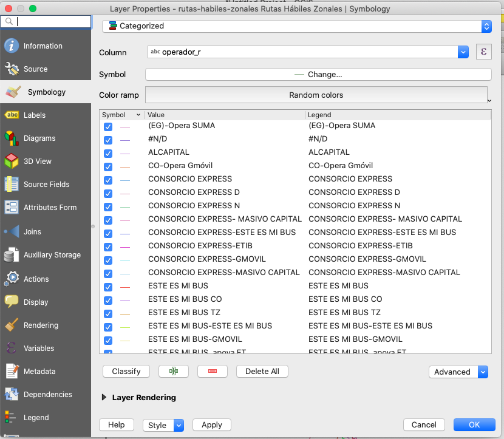
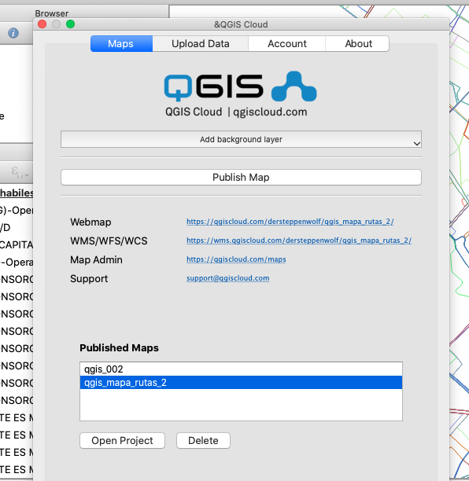

# Ejemplo Tarea 00

## Título

Mapa web Rutas urbanas Bogotá

## Descripción

Mapa de ejemplo clase

## Fuente de datos

Datos abiertos Bogotá https://datosabiertos.bogota.gov.co/dataset/ruta-urbana

##  Herramientas

- QGIS
- QgisCloud

##  Proceso Realizado

- Se descargó la información en formato .shp
- Se configuró simbología a través de clasificación categórica por atributo único.

- Mapa resultante:

- Se realizó la publicación del mapa en la web utilizando QgisCloud

##  Urls

- Mapa Web https://qgiscloud.com/dersteppenwolf/qgis_mapa_rutas_2/?bl=&st=&l=rutas-habiles-zonales%20Rutas%20H%C3%A1biles%20Zonales&t=qgis_mapa_rutas_2&e=-74.38875%2C4.48498%2C-73.77022%2C4.79034

- WMS https://qgiscloud.com/dersteppenwolf/qgis_mapa_rutas_2/wms?SERVICE=WMS&REQUEST=GetCapabilities

